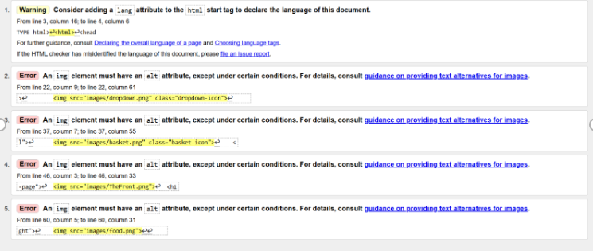
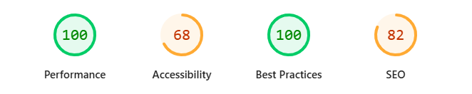

Design
Aims and Objectives

The aim of this project is to design and develop a central, accessible website for Kombu that provides all essential restaurant information in one place and simulates an online ordering experience.

The website is intended to solve the current lack of an official online presence. At present, Kombu only exists through a Google Maps listing and a Facebook page, which limits how easily customers can access reliable and up-to-date information. Users are unable to consistently view menus, check prices, or confirm details before visiting, which can reduce trust and discourage potential customers.

To address this, the website will aim to:

Provide a single, reliable source of information for menu items, prices, and restaurant details
Allow users to browse food items quickly and efficiently
Include a simple ordering/basket system to simulate a real ordering experience
Ensure clear and intuitive navigation between sections
Prioritise accessibility through high-contrast design and readable layouts
Minimise distractions to support users with cognitive conditions such as ADHD
User Stories
First-Time Visitor (Persona 1)

User Story:
As a first-time visitor with red-green colour blindness, I want to quickly find the menu on the homepage so that I can decide whether the restaurant offers food I like and whether I want to visit.

Tasks:

Locate the menu section on the homepage
Identify menu items using high-contrast text (orange on black)
Click the menu button to view additional details

Acceptance Criteria:

The menu button is visible without scrolling
Users can locate the menu within 10 seconds
Menu items use high-contrast colours for easy reading
Returning Visitor (Persona 2)

User Story:
As a returning visitor with ADHD, I want to navigate the website quickly without unnecessary distractions so that I can focus on finding the order option and completing my task efficiently.

Tasks:

Scan the homepage to identify the main action
Use a simple layout to avoid distractions
Click large, clearly labelled buttons to move between sections
Quickly locate the “Order Now” option

Acceptance Criteria:

Main action (e.g. “Order Now”) is clearly visible on the homepage
Layout includes only essential sections such as menu, order, and contact
Buttons are large, clearly labelled, and consistently placed
Frequent Visitor (Persona 3)

User Story:
As a frequent visitor with low vision, I want to place an order quickly through a clear and simple ordering process so that I can save time and have a smooth experience.

Tasks:

Navigate directly to the Order Now section
Select favourite menu items
Confirm selections using large, clear buttons
Complete the checkout process

Acceptance Criteria:

Order Now button is clearly visible in the main navigation
Ordering process requires three steps or fewer
Page uses large, readable text and high-contrast colours
Selected menu items are visually highlighted or clearly confirmed
Development / Reflection

The main change that will be made is to the menu. It will group common food categories together so they are easier to find. This change was made for the ADHD user. This would mean they will be able to make decisions faster and more effectively than getting overwhelmed with a large amount of food listings.

Challenge Faced During Development

Minimise the use of JavaScript. Initially, I avoided using JavaScript as the assignment focus was on HTML and CSS, and that is why I copy and pasted similar headers on separate pages. However, when I began programming the menu and basket structures, it became obvious that I would not be able to avoid it, as the pages require JavaScript in order to communicate and store the items that have been ordered. This also saved me from writing down the same food items for multiple sections.

Manual Testing

One issue with the initial game platform was that the basket was already showing items when the user first visited the site. This shouldn’t have happened because it made it look like previous users’ data was being carried over.

To fix this, I used JavaScript to control the basket state using session-based storage. This means the basket is now set up to reset whenever a new session starts, so no old items are kept when a user loads or refreshes the page.

This change ensures the basket always starts empty, making the behaviour more consistent and improving the overall user experience.

Another issue that stood out was that users could place an order without entering their details (e.g. date, time, phone number). This was fixed by implementing JavaScript again and making sure the order does not go through if those areas are not filled.

One more issue was there was no way to remove items from the basket, and the users had to relocate the item in the menu to remove a food item.

Automated Testing
W3C (HTML and CSS Validators)

W3C Test

Google Lighthouse

Findings

After running this, it was quite noticeable my main error was not adding alt text to images. Additionally, not including a meta description for each page. Running Google Lighthouse also showed that I did not have a landing page.
