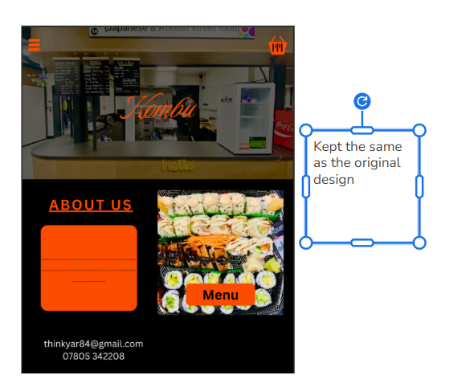
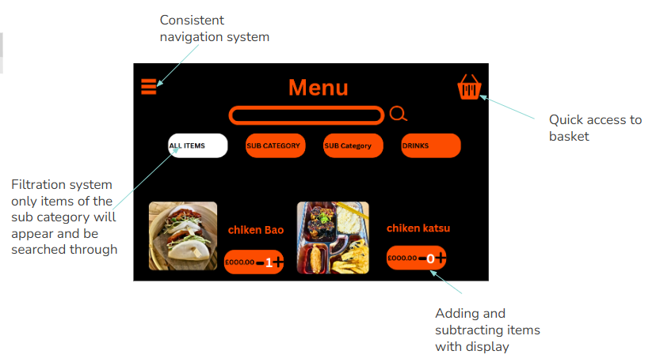
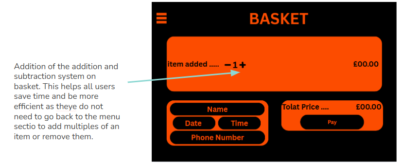
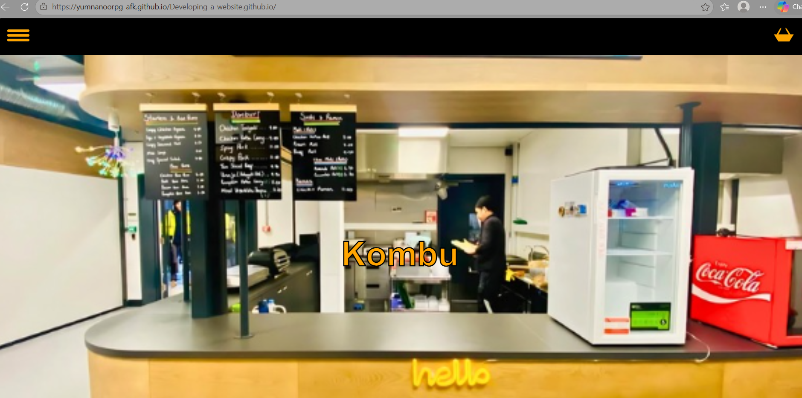
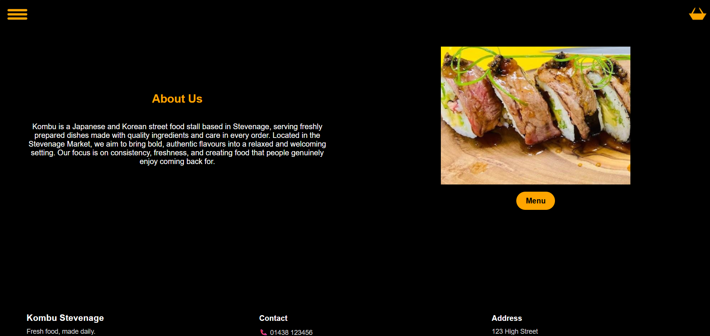
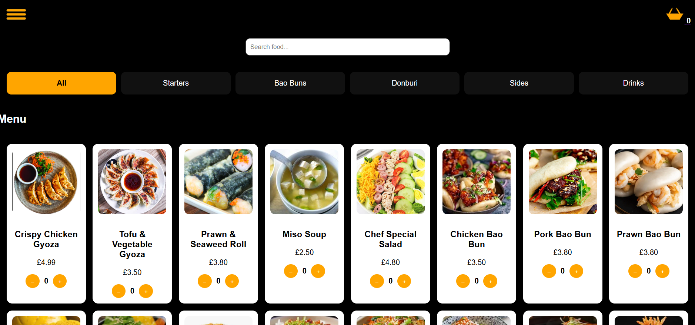
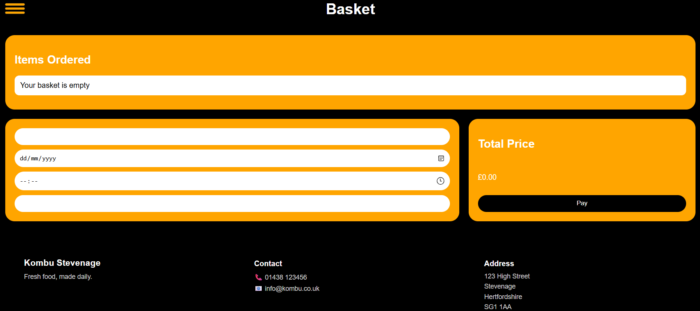
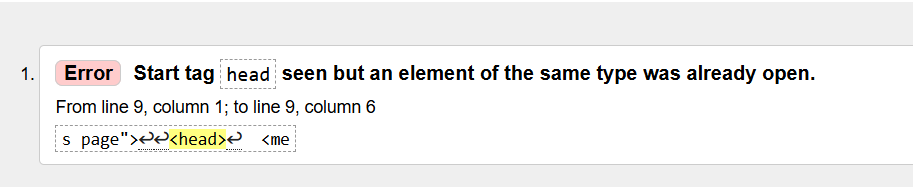
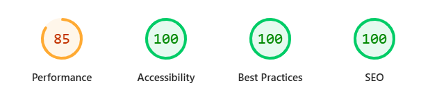

Design  
Aims and Objectives  

The aim of this project is to design and develop a central, accessible website for Kombu that provides all essential restaurant information in one place and simulates an online ordering experience.  
  
The website is intended to solve the current lack of an official online presence. At present, Kombu only exists through a Google Maps listing and a Facebook page, which limits how easily customers can access reliable and up-to-date information. Users are unable to consistently view menus, check prices, or confirm details before visiting, which can reduce trust and discourage potential customers.

To address this, the website will aim to:  

-Provide a single, reliable source of information for menu items, prices, and restaurant details
-Allow users to browse food items quickly and efficiently
-Include a simple ordering/basket system to simulate a real ordering experience
-Ensure clear and intuitive navigation between sections
-Prioritise accessibility through high-contrast design and readable layouts
-Minimise distractions to support users with cognitive conditions such as ADHD
-User Stories
-First-Time Visitor (Persona 1)

User Story:
As a first-time visitor with red-green colour blindness, I want to quickly find the menu on the homepage so that I can decide whether the restaurant offers food I like and whether I want to visit.

Tasks:

-Locate the menu section on the homepage  
-Identify menu items using high-contrast text (orange on black)  
-Click the menu button to view additional details

Acceptance Criteria:

-The menu button is visible without scrolling
-Users can locate the menu within 10 seconds
-Menu items use high-contrast colours for easy reading
-Returning Visitor (Persona 2)

User Story:
As a returning visitor with ADHD, I want to navigate the website quickly without unnecessary distractions so that I can focus on finding the order option and completing my task efficiently.

Tasks:

-Scan the homepage to identify the main action
-Use a simple layout to avoid distractions
-Click large, clearly labelled buttons to move between sections
-Quickly locate the “Order Now” option

Acceptance Criteria:

-Main action (e.g. “Order Now”) is clearly visible on the homepage
-Layout includes only essential sections such as menu, order, and contact
-Buttons are large, clearly labelled, and consistently placed  

Frequent Visitor (Persona 3)

User Story:
As a frequent visitor with low vision, I want to place an order quickly through a clear and simple ordering process so that I can save time and have a smooth experience.

Tasks:

-Navigate directly to the Order Now section
-Select favourite menu items
-Confirm selections using large, clear buttons
-Complete the checkout process

Acceptance Criteria:

-Order Now button is clearly visible in the main navigation
-Ordering process requires three steps or fewer
-Page uses large, readable text and high-contrast colours
-Selected menu items are visually highlighted or clearly confirmed
-Development / Reflection

Upgraded wire frame:

The main change that will be made is to the menu. It will group common food categories together so they are easier to find. This change was made for the ADHD user. This would mean they will be able to make decisions faster and more effectively than getting overwhelmed with a large amount of food listings.

Development  
implimenting the improved design:  

  

  

Tools and Technologies Used:  

-HTML to structure the content and pages
-CSS to design the layout, including the use of flexbox and grid for responsiveness
-JavaScript to implement interactivity, including:
--menu filtering
--basket functionality
-GitHub Pages for deployment and hosting

Key Design and Coding Decisions:  
One key decision was to use a grid layout for the menu. This allows multiple items to be displayed clearly at once, improving usability and supporting faster decision-making for users.  
Another important decision was to implement a JavaScript-based basket system. Instead of using a backend, the basket stores items on the client side, allowing the website to simulate ordering functionality without requiring a database.  
A fixed navigation bar was used to ensure users can easily move between sections at any time. This improves usability for returning users who want to complete actions quickly and for new useers as they can rely ong a consistentant navigation system.  
Accessibility was also a major consideration. High-contrast colour schemes and clear button design were used to support users with visual impairments, as identified in the user stories.

Challenges faced and Solutions:  
1. Avoiding JavaScript Initially:

Initially, I avoided using JavaScript as the assignment focus was on HTML and CSS. This led to repeating similar structures across multiple pages, such as copying and pasting headers and menu content.However, when developing the menu and basket functionality, it became clear that JavaScript was necessary. The pages needed to communicate with each other and store selected items, which cannot be achieved using HTML and CSS alone.

Solution:  
JavaScript was implemented to handle menu interactions and basket functionality. This not only enabled communication between pages but also reduced repetition, as menu items no longer needed to be manually duplicated across different sections.

2. Basket State Issue:
An issue in the initial version of the website was that the basket already contained items from when the privious user visited the site which could negatively affects user experience as sthey pay end up paying for items they did not wish to order.

Solution:
JavaScript was used to control the basket state using session-based storage. This ensures that the basket resets whenever a new session starts, so no previous items are retained when the page is loaded or refreshed.This change ensures the basket always starts empty, making behaviour more consistent and improving overall usability.

3. Form Validation Issue

Another issue identified was that users were able to place an order without entering required details such as date, time, and phone number. This made the ordering process incomplete and unrealistic.

Solution:
JavaScript validation was implemented to ensure that all required fields are completed before an order can be submitted. If any fields are missing, the order is prevented from going through.This improves both functionality and user experience by ensuring that only valid orders can be processed.

Manual Testing

Manual testing was carried out to ensure that all user stories were successfully implemented and that the website functions as intended.

User Story Testing  

-First-Time Visitor (Persona 1)  
--Test: Open homepage and attempt to locate the menu  
--Expected Outcome: Menu is visible without scrolling and readable  
-- Result: Passed  
--Notes: High-contrast colours (orange on black) made menu items clearly visible

-Returning Visitor (Persona 2)  
--Test: Navigate through the website and locate the “Order Now” option  
--Expected Outcome: User can quickly identify the main action without distractions  
--Result: Passed  
--Notes: Simple layout and large buttons improved navigation speed  

-Frequent Visitor (Persona 3)  
--Test: Add items to basket and complete ordering process  
--Expected Outcome: User can complete ordering in a few steps
--Result: Passed  
--Notes: Basket system allowed quick selection and review of items  

   
Bugs and Fixes
No major unresolved issues affecting functionality were found

Automated Testing
W3C Validation  

  
only minor issues were reveealed that did not affect functionality. Mainly to do with not adding alt(information about the image incase the image does not load)

Google Lighthouse Testing  

Analysis of Results

Accessibility received the lowest score (68). The main issue identified was missing alternative text (alt attributes) on images. This affects users who rely on screen readers, as images cannot be interpreted without descriptive text. 
Additional errors were not adding a meta description to pages and not having a landing page.

After running the checks the following improvements were made:
-Alt attributes were added to all menu images with clear descriptions.
-meta description was added.
-The home section was wrapped in <main> tag to make it the landing page.

After fix automated test 

W3C Test

Google Lighthouse

